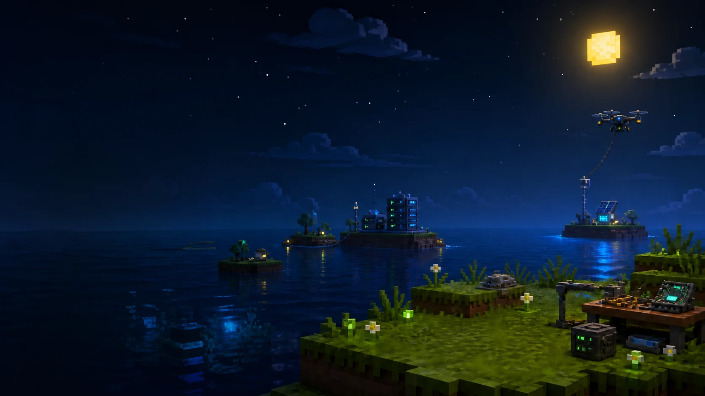

# Ishaq Ishaq Nasiru Portfolio

A responsive portfolio for Ishaq Ishaq Nasiru, a Computer Science student and software developer building software, embedded systems, IoT projects, AI tools, and real-world technical solutions.



## Live Site

[ameer-sys.github.io/ishaq-portfolio](https://ameer-sys.github.io/ishaq-portfolio/)

## Technology

- Semantic HTML5
- Modern responsive CSS with light and dark themes
- Vanilla JavaScript
- Canvas API for the Tech Stack mini-game
- FormSubmit for the static contact form
- GitHub Pages for production hosting

## Run Locally

No build step is required.

```powershell
python -m http.server 4173
```

Open `http://127.0.0.1:4173`.

## Project Structure

```text
assets/                    Brand images, project visuals, icons, and resume
data/portfolio-data.js     Projects, experience, community, and skills
scripts/verify-browser.cjs Playwright browser verification
index.html                 Semantic page structure and metadata
script.js                  Rendering, theme, navigation, form, and game logic
styles.css                 Layout, themes, responsive design, and motion
```

## Content Maintenance

Portfolio entries are centralized in `data/portfolio-data.js`. Optional fields such as GitHub and live URLs render only when real values are present. Project status labels distinguish completed work, prototypes, and active development.

## Deployment

The static site is published from the `gh-pages` branch. All production asset references use repository-relative paths so the site works at the GitHub project Pages URL. The `.nojekyll` marker keeps GitHub Pages from applying Jekyll processing.

The previous Vercel project remains available temporarily as a fallback while the GitHub Pages deployment is verified.

## Contact Form

The contact form submits directly from the browser to FormSubmit and does not depend on Vercel serverless functions. FormSubmit may require a one-time email activation before first use.
